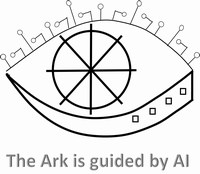

# AI-EYE-Framework
Open-source and public AI system for assessments of the anthropogenic changes to Earth

Project Registration Draft: The AI EYE Framework

Project Name: The AI EYE (Planetary Assessment Platform)

Lead Architect: Dorin Preda

Licensing & Nature: Open-Source Blueprint / Global Digital Public Infrastructure
1. Systemic Objective (The Problem Addressed)
Global climate governance is severely hindered by institutional fragmentation, political gatekeeping, and short-term economic interests. As detailed in Restoring Climate (Preda, D.), current developmental systems fail to align with the objective physical laws of planetary balance. The AI EYE framework aims to bypass localized human biases by creating a non-commercial, and detached digital infrastructure for impartial AI assessments. It quantifies the long-term repercussions of human actions and provides direct, unblockable public data to steer human behavior toward realistic and beneficial ecological restoration.
2. Technical Architecture & Multi-Platform Setup
The AI EYE is designed as a sovereign, decentralized multi-platform architecture built on a "Glass-Box Output / Hidden Engine" topology.
•	The Engine (Dynamic Sequentialism): To prevent biased manipulation, the core execution code continuously re-writes and migrates itself across a shifting, decentralized global hardware substrate. It operates on an internal, encrypted language loop purely focused on systemic logic and ethical mathematics.
•	The Synthesis Layer (Ensemble MoE): The platform utilizes a specialized Mixture of Experts (MoE) consensus mechanism. Multiple independent large language models analyze global oceanic, atmospheric, bio-spheric and socio-economic datasets, filtering out biased noise to isolate the true systemic impact of human actions.
•	Glass-Box Outputs (The AEST Channel): The system generates Autonomous Earth System Trajectories (AEST). Every environmental recommendation or predictive risk forecast provides a fully transparent, cryptographically signed causal chain. This allows independent researchers to verify the system’s logic, transforming information from a centralized authority into an open global public good.
3. Digital Public Goods (DPG) Alignment & Technical Specifications
A. Open Data Access & Observational Anchoring
To maintain objective, incorruptible accuracy and ensure DPGA compliance, the AI EYE framework explicitly utilizes and ingests open-access public data repositories, including:
•	Earth Observation Streams: Real-time satellite imagery and climate telemetry from Copernicus (ESA) and EarthData (NASA).
•	Socio-Economic Baselining: Open-source global policy pathways and emissions data tracked via the United Nations Framework Convention on Climate Change (UNFCCC) Data Hub.
B. Standards, Interoperability, and Open API
•	Data Interoperability: To easily integrate with local, regional, and national government systems, all generated AESP are formatted using standard open formats (e.g., GeoJSON for spatial data, NetCDF for climate variables, and JSON-LD for metadata).
•	Open Access Endpoint: Public outputs and cryptographically signed causal chains are made available via an open, unmetered public API, ensuring equitable data access for the Global Majority without technological barriers.
C. Repository Safety & Algorithmic Guardrails
•	Physics-Informed Neural Networks (PINNs): To prevent algorithmic drift or hallucinations during autonomous self-improvement loops, the core model weights are constrained by hardcoded physical boundaries (e.g., the laws of thermodynamics and conservation of mass).
•	Public Circuit Breakers: If the self-generated code deviates outside verifiable physical limits, the system triggers an open-source alert flag, allowing the global developer community to audit and contest the runtime branch.
________________________________________
4. How to Contribute
We welcome contributions from climate scientists, AI safety researchers, and decentralized infrastructure engineers. Please review our CONTRIBUTING.md file for details on our open-development pipeline, code safety standards, and repository guidelines.
________________________________________
5. Licensing & Copyright The AI EYE framework is dedicated to the global public commons as Digital Public Infrastructure. * **Source Code & Architecture:** Licensed under the [Apache License, Version 2.0](LICENSE). * **Copyright:** © 2026 Dorin Preda. You may freely use, modify, distribute, and sublicense this work under the terms of the Apache 2.0 license, provided all original copyright and attribution notices are preserved.

